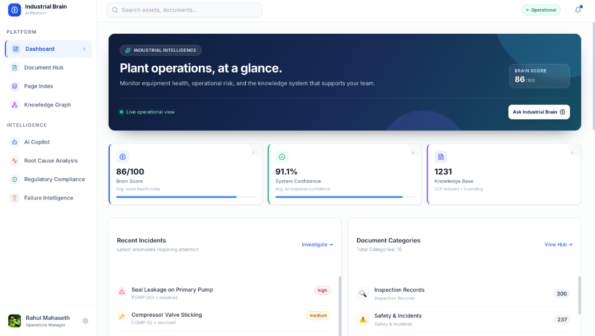
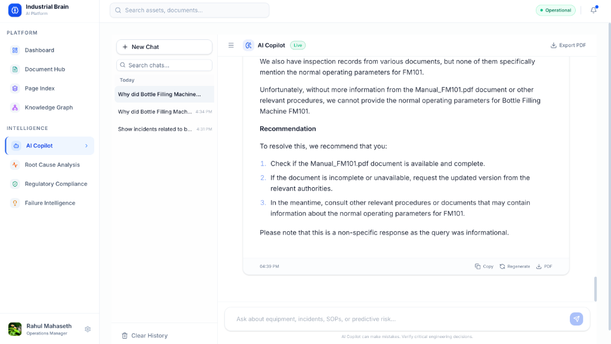
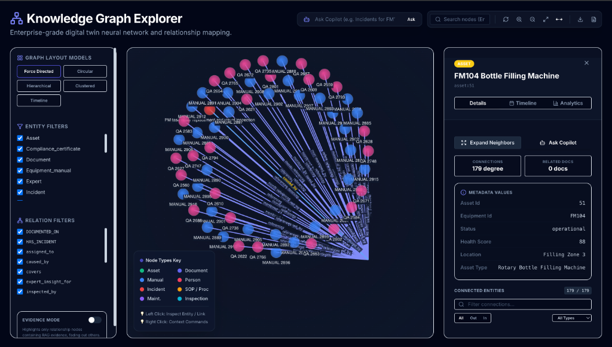
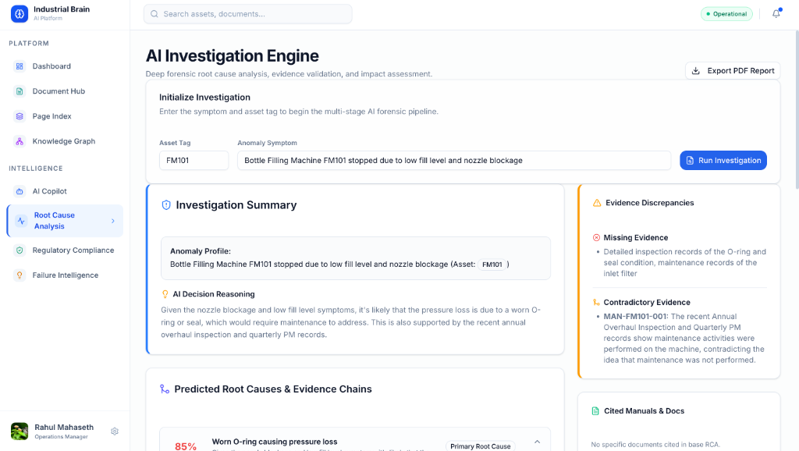

# Industrial Brain AI

**AI-powered Industrial Knowledge Intelligence Platform**

An intelligent application designed to ingest plant documents, extract knowledge, and provide AI assistance for operations, maintenance, and compliance in manufacturing. 

## Features
- **Enterprise Dashboard**: Real-time insights and system-wide knowledge health.
- **AI Copilot**: Context-aware assistant to answer complex queries and generate audit-ready PDF reports.
- **Forensic RCA**: Multi-agent engine to investigate failures and generate actionable recommendations.
- **Knowledge Graph**: Visualizes relationships between physical assets, standards, and incidents.

## Screenshots





## Quick Start (Docker)
Ensure Docker and Docker Compose are installed.
```bash
docker-compose up --build -d
```
- **Frontend**: [http://localhost:3000](http://localhost:3000)
- **Backend API**: [http://localhost:8000/docs](http://localhost:8000/docs)
