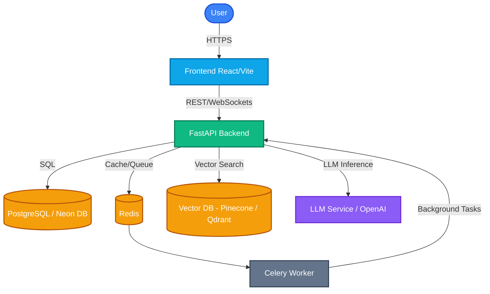
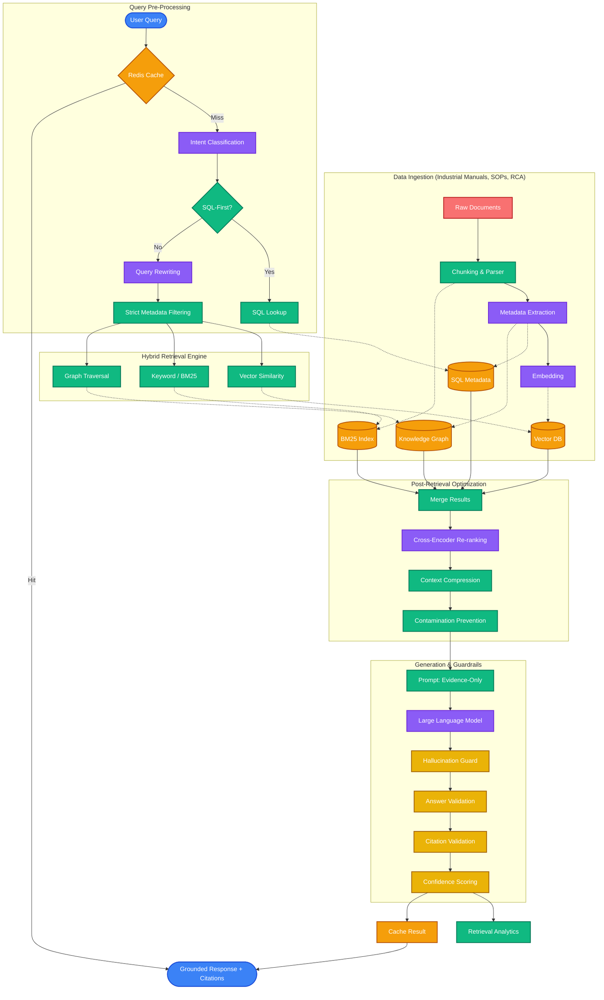
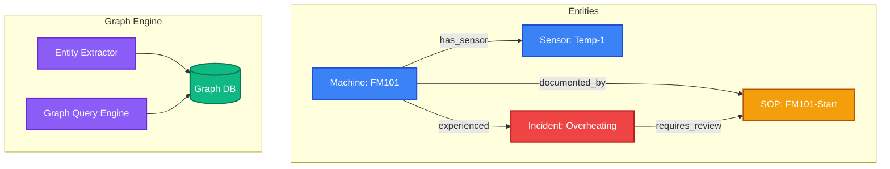
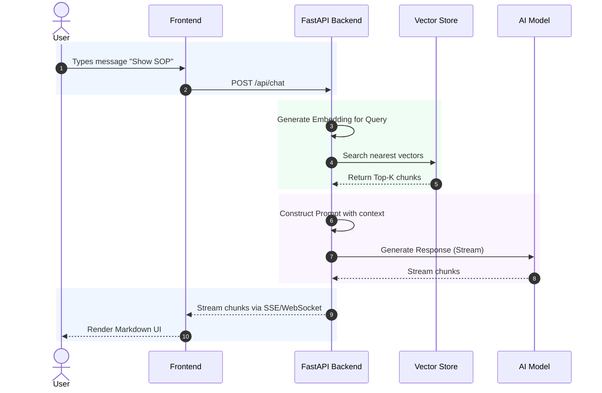
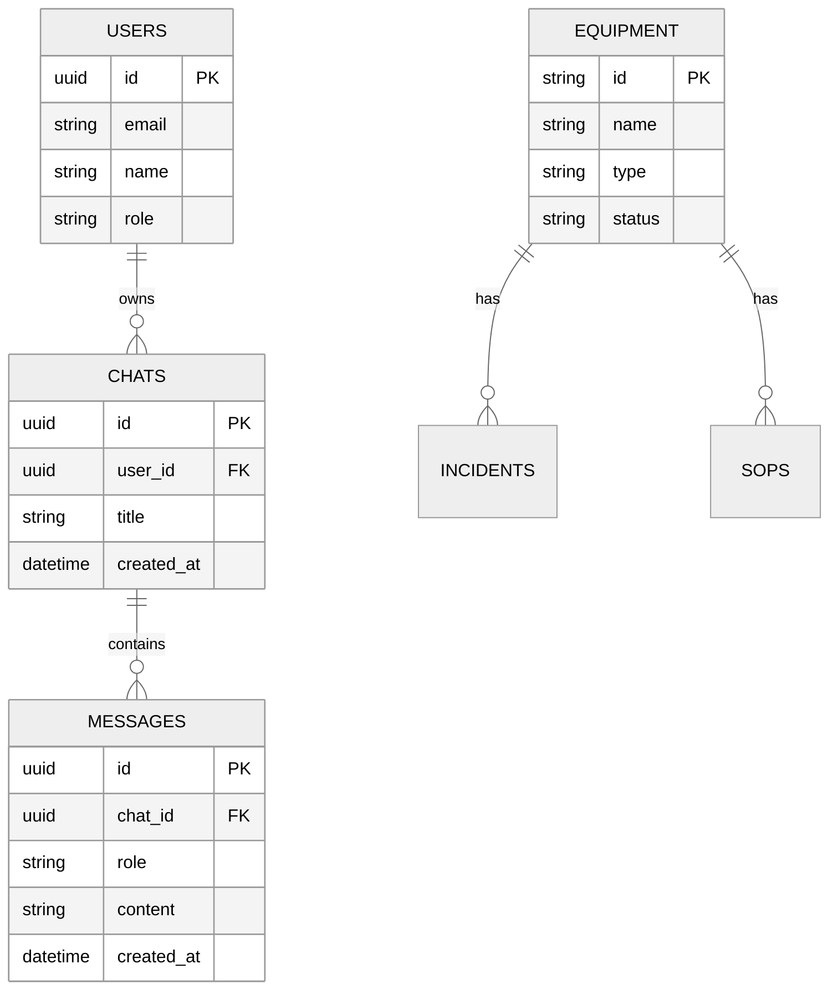
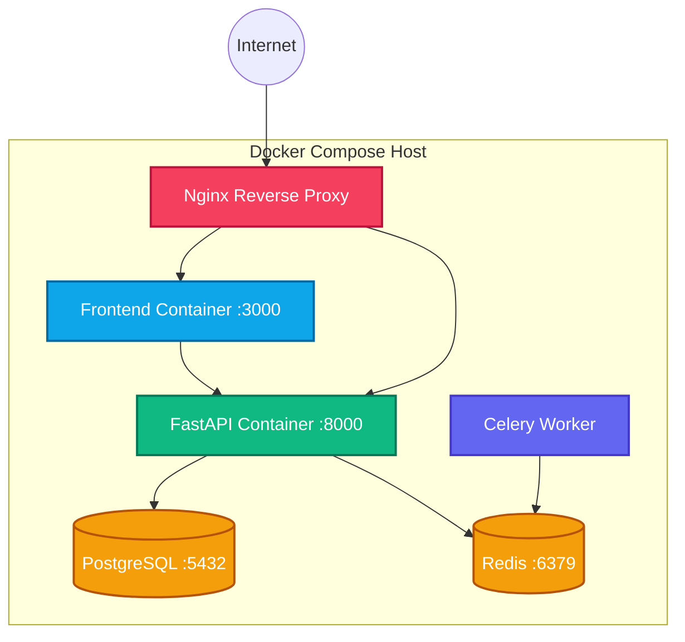
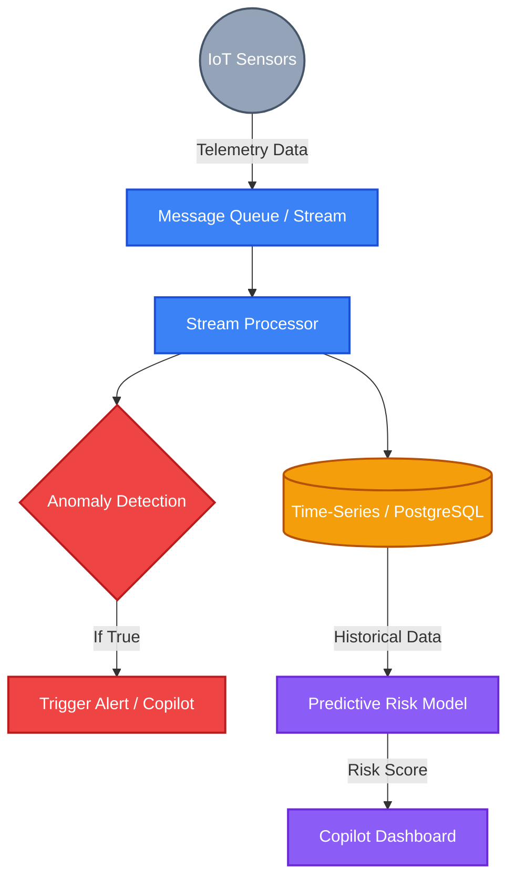
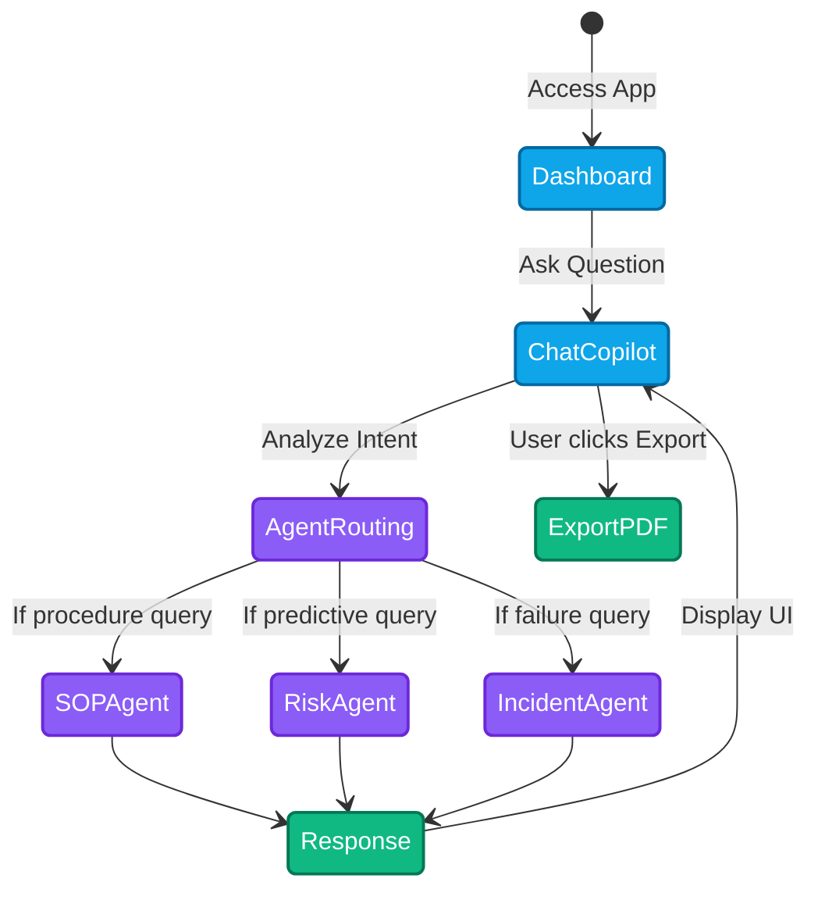
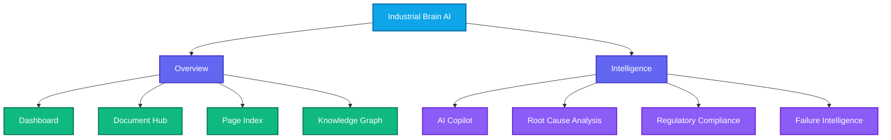

# Industrial Brain AI - Architecture Diagrams (Colored Edition)

This document outlines the core architecture, pipelines, and workflows of the Industrial Brain AI platform through visual, color-coded diagrams.

## 1. System Architecture
High-level overview of the interaction between the frontend, backend, databases, and AI services.

## 2. RAG (Retrieval-Augmented Generation) Pipeline
Describes how unstructured data (SOPs, manuals) is ingested and how user queries retrieve context for the LLM.

## 3. Knowledge Graph Architecture (GraphRAG)
Shows how industrial entities are linked conceptually to provide rich, context-aware answers.

## 4. Sequence Diagram: AI Copilot Chat
Interaction flow during a real-time Copilot chat session, with color-coded regions mapped to the journey from user prompt to streaming response.

## 5. Database ER (Entity-Relationship) Diagram
Core PostgreSQL schema highlighting how Users, Chats, Messages, and Equipment are related. Rendered with the neutral theme for clarity.

## 6. Deployment Architecture
Containerized deployment layout, showing how Docker Compose orchestrates the stack locally or in the cloud.

## 7. Data Flow Diagram
Tracks the lifecycle of IoT sensor data through stream processing into the Predictive Risk models.

## 8. Application Workflow
State diagram showing the user journey and dynamic AI Agent routing based on user intent.

## 9. Intelligence Modules Architecture
Maps out the core feature navigation within the application, specifically highlighting the AI-driven "Intelligence" suite.

